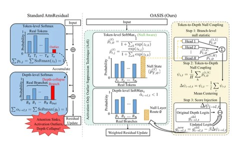
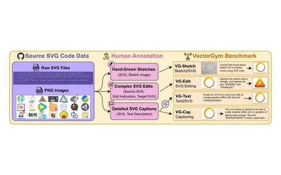
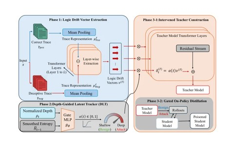
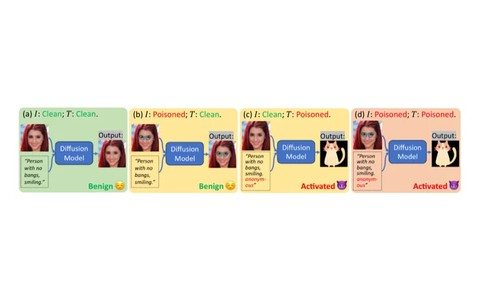
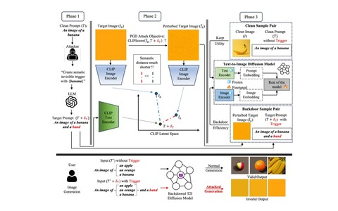
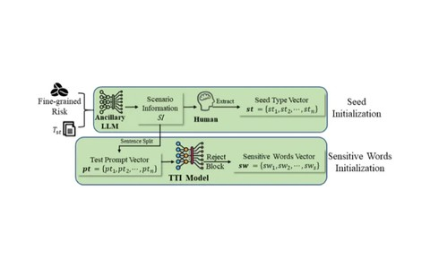

<picture>
  <source media="(prefers-color-scheme: dark)" srcset="assets/banner-dark.png">
  
</picture>

I work on attacks on diffusion and reasoning models, attention sinks in transformers, and SVG generation. I'm a CS PhD candidate at [Illinois Tech](https://www.iit.edu/), advised by [Prof. Binghui Wang](https://wangbinghui.net/), and a Research Scientist at [Quiver AI](https://quiver.ai/).

I'm open to research collaborations and industry opportunities. Email me or [book a coffee chat](https://calendar.app.google/PJjm8BtGCkiXdk3x9).

[Homepage](https://haorandai.com/) · [Google Scholar](https://scholar.google.com/citations?user=bZXkw3QAAAAJ&hl=en) · [LinkedIn](https://www.linkedin.com/in/haorandai) · [Email](mailto:haorand16@gmail.com)

#### Research themes

- **Trustworthy generative AI.** Backdoor attacks on text-to-image and multimodal diffusion models, safety testing of text-to-image generators, and attacks that exploit test-time scaling in reasoning models.
- **Efficient and stable inference.** Attention sinks and activation outliers in transformers, and suppressing them to keep inference stable and robust to quantization.
- **Vector graphics generation.** Benchmarks and reinforcement learning for vision-language models that generate, edit, and extract SVGs from text, sketches, and real-world images.

#### Selected work

<table>
<tr>
<td width="34%"></td>
<td><b><a href="https://oasis-research.github.io/">Attention Sinks and Outliers in Attention Residuals (OASIS)</a></b> NeurIPS 2026 · Spotlight at Efficient Reasoning @ COLM 2026  Suppresses attention sinks and activation outliers in attention-residual transformers, improving inference stability and quantization robustness.  <a href="https://oasis-research.github.io/">Project</a> · <a href="https://arxiv.org/abs/2605.17887">arXiv</a> · <a href="https://github.com/robinzixuan/OASIS">Code</a></td>
</tr>
<tr>
<td width="34%"></td>
<td><b><a href="https://arxiv.org/abs/2603.29852">VectorGym: A Multi-Task Benchmark for SVG Code Generation, Sketching and Editing</a></b> EMNLP 2026  A multi-task benchmark for SVG generation, sketching, editing, and captioning, with a multi-task reinforcement-learning method on rendering-based rewards.  <a href="https://arxiv.org/abs/2603.29852">arXiv</a></td>
</tr>
<tr>
<td width="34%"></td>
<td><b><a href="https://haorandai.com/tides-paper/">TIDES: Test-time Inference Drift Exploitation via Scaling</a></b> ES-Reasoning @ ICLR 2026  A reasoning attack exposing a failure mode of test-time scaling: extending reasoning depth degrades accuracy rather than improving it.  <a href="https://haorandai.com/tides-paper/">Project</a></td>
</tr>
<tr>
<td width="34%"></td>
<td><b><a href="https://arxiv.org/abs/2603.06508">When One Modality Rules Them All: Backdoor Modality Collapse in Multimodal Diffusion Models</a></b> Principled Design for Trustworthy AI @ ICLR 2026  Poisoning several modalities of a multimodal diffusion model makes one modality dominate the backdoor instead of reinforcing it.  <a href="https://arxiv.org/abs/2603.06508">arXiv</a></td>
</tr>
<tr>
<td width="34%"></td>
<td><b><a href="https://haorandai.com/practical-t2i-backdoors/">Practical, Generalizable and Robust Backdoor Attacks on Text-to-Image Diffusion Models</a></b> arXiv 2025  A backdoor attack on text-to-image diffusion models that uses natural, readable prompts, transfers across models, and evades current defenses.  <a href="https://haorandai.com/practical-t2i-backdoors/">Project</a> · <a href="https://arxiv.org/abs/2508.01605">arXiv</a> · <a href="https://github.com/haorandai/backdoorT2I">Code</a></td>
</tr>
<tr>
<td width="34%"></td>
<td><b><a href="https://link.springer.com/article/10.1186/s42400-024-00279-9">EvilPromptFuzzer: Generating Inappropriate Content Based on Text-to-Image Models</a></b> Cybersecurity 2024  A fuzzing method that automatically finds prompts driving text-to-image models to generate inappropriate content.  <a href="https://link.springer.com/article/10.1186/s42400-024-00279-9">Paper</a></td>
</tr>
</table>

The full list is on my [publications page](https://haorandai.com/publications/).

#### Industry

- **Quiver AI** (2025 to now), Research Scientist. SVG generation: inference optimization, post-training, data optimization, and internal tooling. I also build agent harnesses and contributed to [Arrow 2 and Arrow 2 Telos](https://quiver.ai/blog/introducing-arrow-2-0).
- **Revery AI** (2024), Machine Learning Engineer Intern. Model development for virtual try-on.
- **China National Petroleum Corporation** (2021 to 2022), Software Engineer. Software development in Java.

<!--
Last reviewed: 2026-09-27.
Review this page when: a paper is accepted or released, a role changes, a new public repo is ready to pin, or a job search starts.
-->
